# Military Explosive Ordnance Disposal (EOD) Robot 🤖💣

## Overview

This repository showcases the documentation, system architecture, and C++ source code for a remote-controlled **Military Explosive Ordnance Disposal (EOD) Robot**. Developed as an undergraduate graduation project in Mechatronics Engineering at the University of the Future (2024), this robotic solution is engineered to safely detect, approach, and handle hazardous explosive objects in dangerous environments, thereby significantly minimizing risks to human operators.

---

## Key Objectives

* **Operator Safety:** Eliminate direct human exposure to explosive threats and hazardous materials.

* **Cost-Effective Design:** Implement a reliable, low-cost robotic architecture utilizing accessible commercial-off-the-shelf components.

* **Remote Teleoperation:** Enable seamless wireless monitoring and real-time motion control from a secure distance (up to 800 meters open range).

---

## Technical Specifications

* **Dimensions:** 25.5 cm (Length) $\times$ 15 cm (Width) $\times$ 10 cm (Height)

* **Total Weight:** 1.5 kg

* **Locomotion:** 4-wheel mobile platform driven by 6V DC motors (250 RPM)

* **Manipulator Arm:** 4-Degree-of-Freedom (4-DOF) robotic arm actuated via precision servo motors (10 kg.cm torque) with a payload capacity of 190 g

* **Vision System:** A9 Mini WiFi Camera (1080P HD) for real-time remote surveillance

* **Power Supply:** 12V 1.5Ah (2500mAh) rechargeable lithium battery providing up to 2 hours of operational life

---

## System Architecture & Hardware Components

* **Microcontrollers:** Arduino Uno R3 (utilized on both the remote control station and the robot platform)

* **Wireless Communication:** HC-12 Long-Range Wireless Serial Module (433.4–473 MHz, up to 1000m range)

* **Motor Drivers:** L298N H-Bridge Driver for DC mobility motors and Fomicro.bit Servo Driver for the robotic arm

* **Control Interface:** Analog Joystick modules for multi-axis directional and arm articulation control

---

## Repository Structure

* `Transmitter.ino`: Arduino C++ code for the remote control unit, reading analog joystick coordinates and formatting them for wireless transmission.

* `Receiver.ino`: Arduino C++ code for the robot platform, parsing incoming serial data strings to control mobility via the L298N driver and manipulate the 4-DOF arm via servos.

## System Architecture

## Project Gallery

* **Robot Chassis & Manipulator Arm:**
  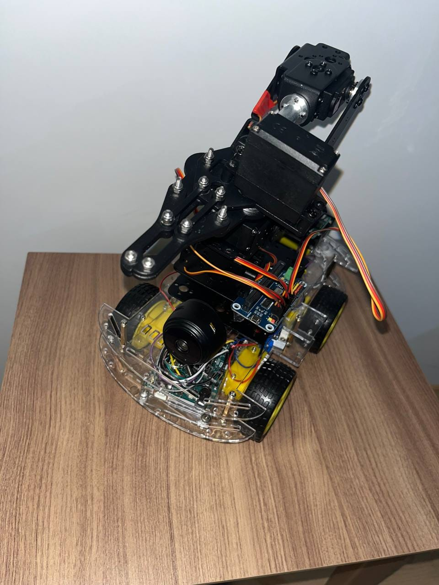 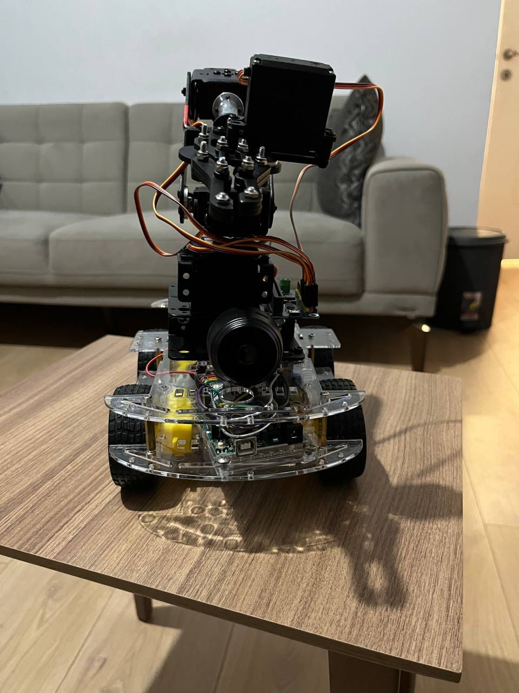 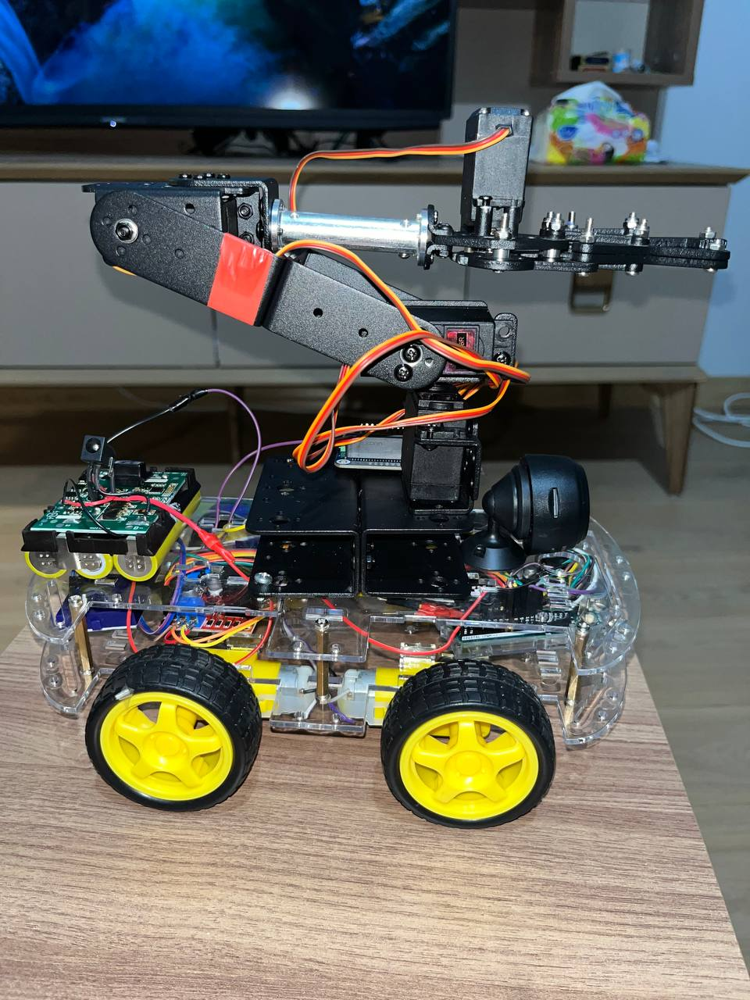 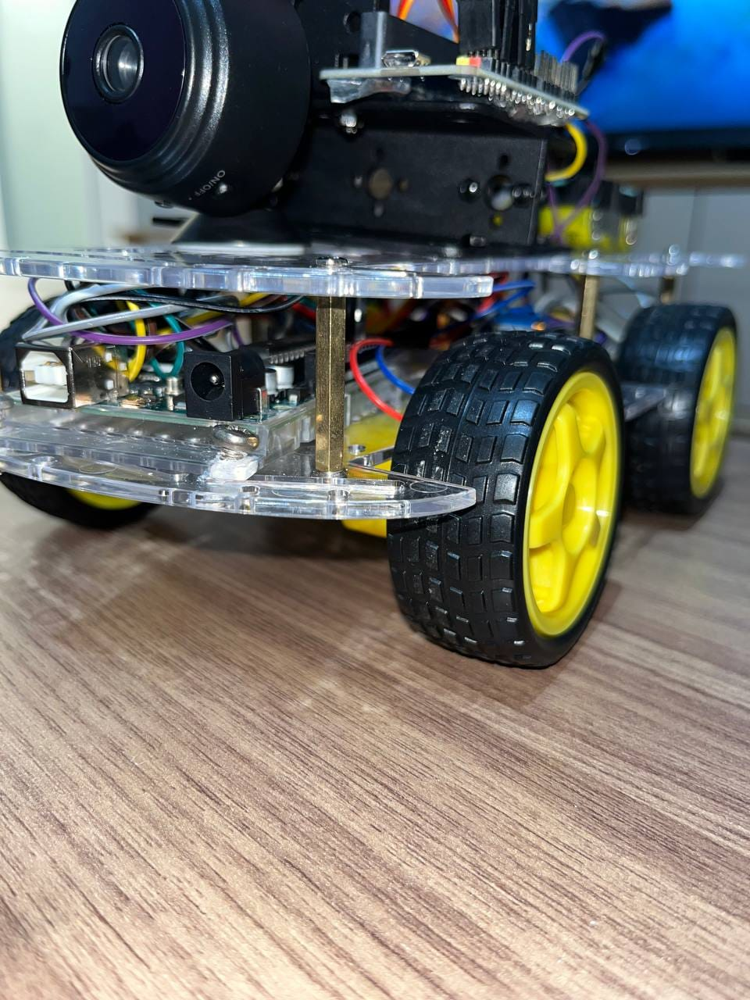

* **Robot Assembly & Testing:**
  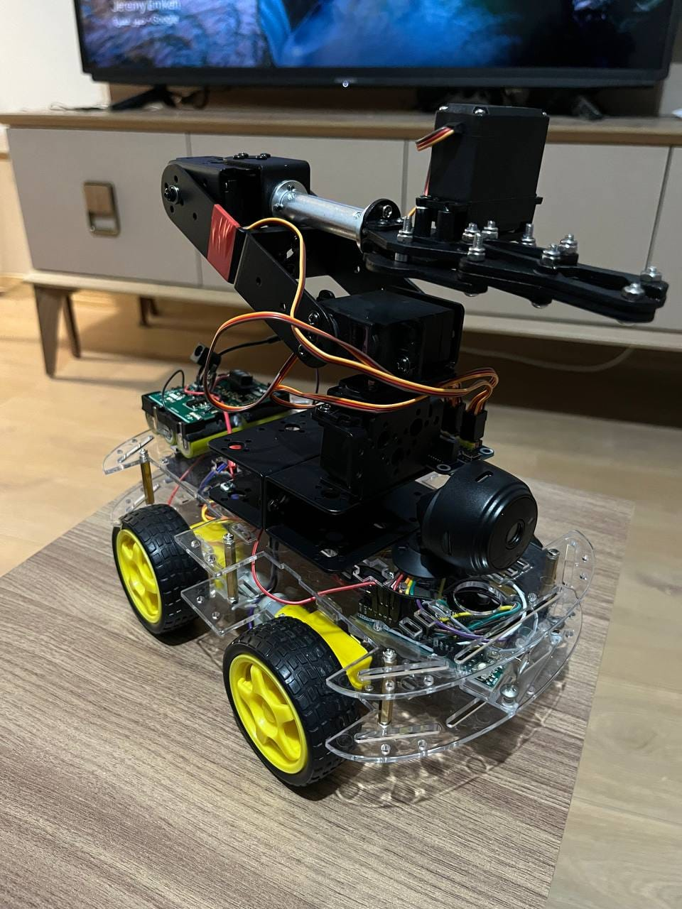 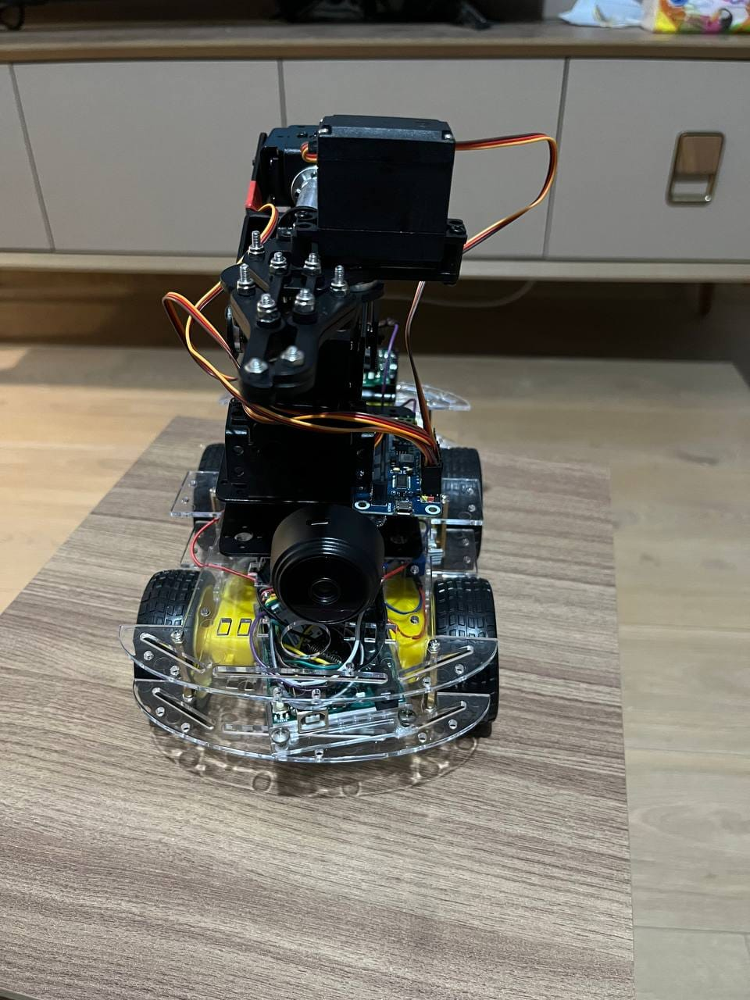 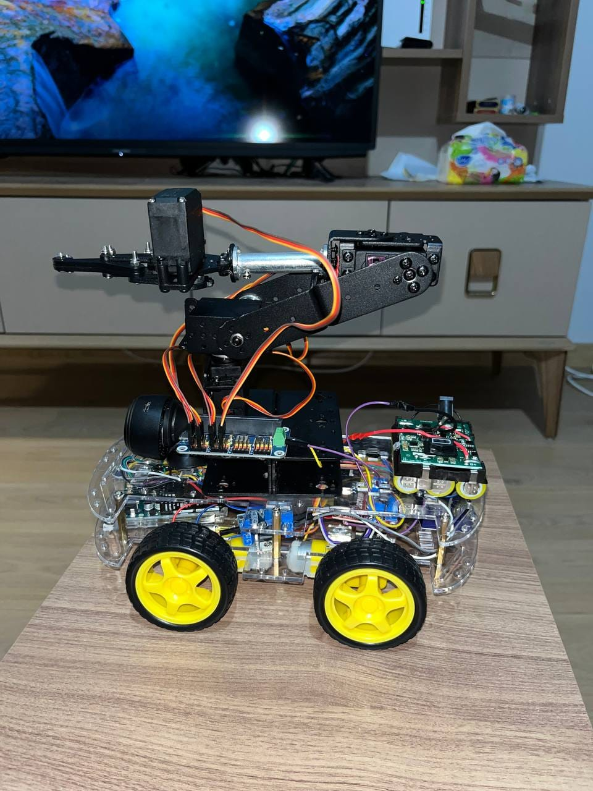

* **Remote Control Station (Transmitter Unit):**
  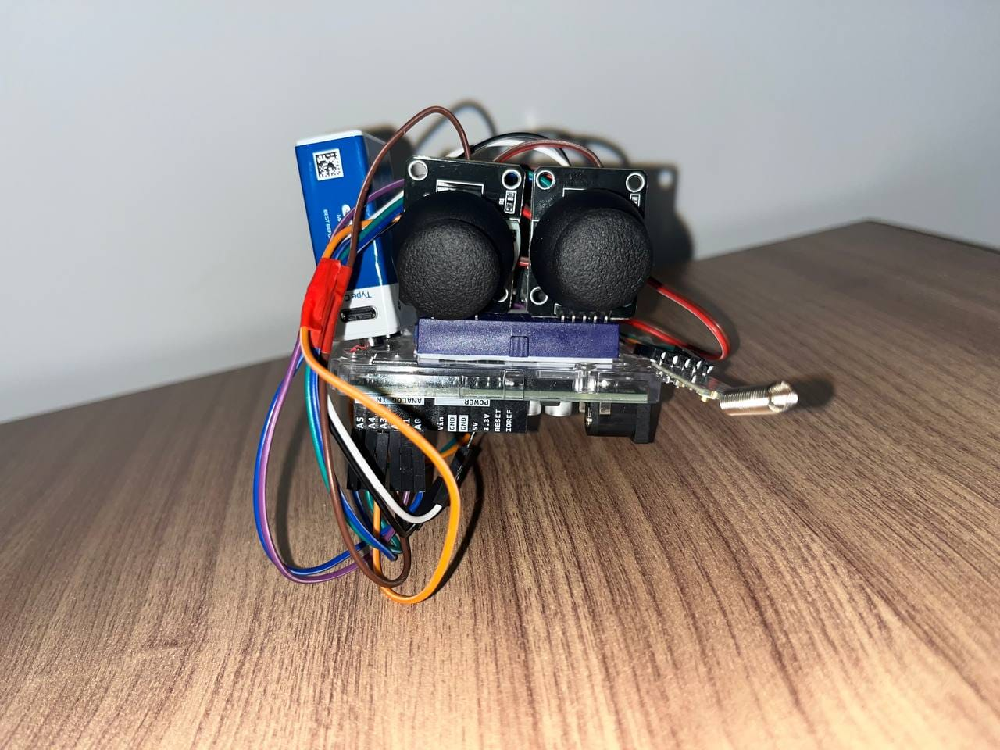 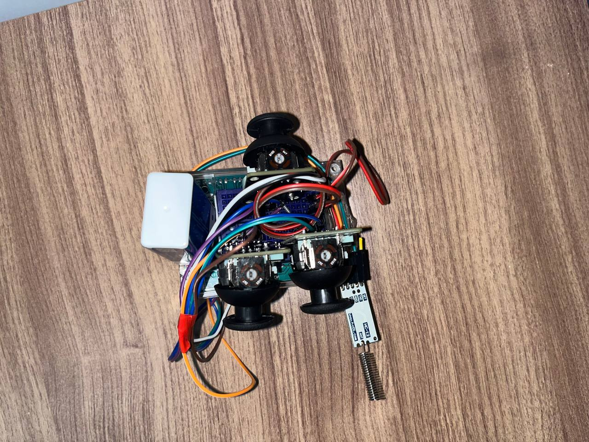 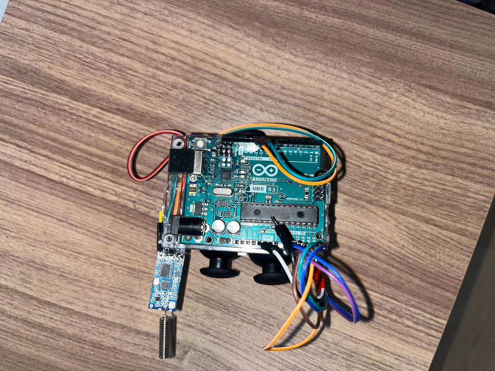 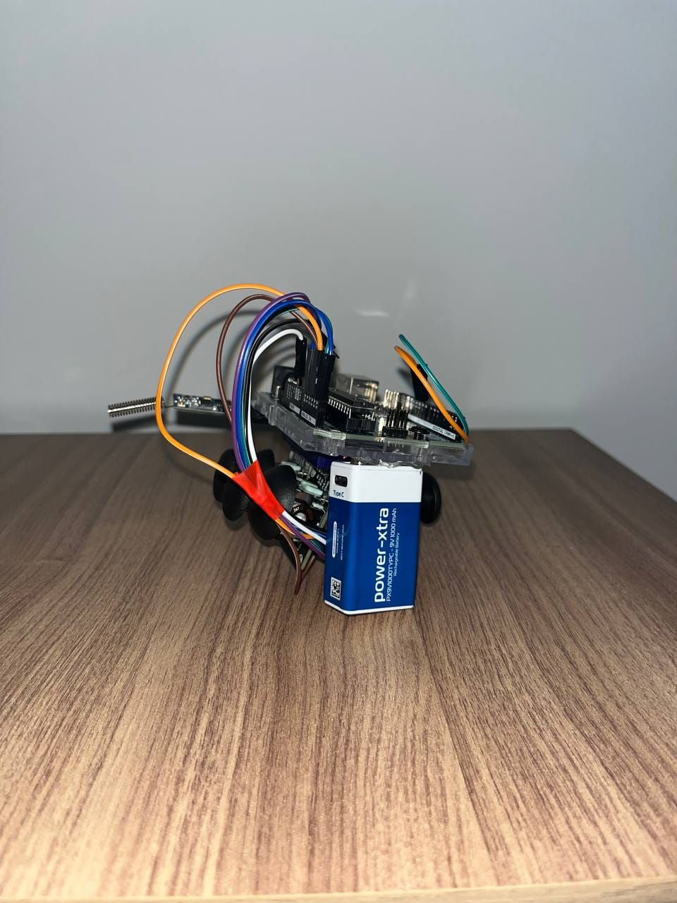 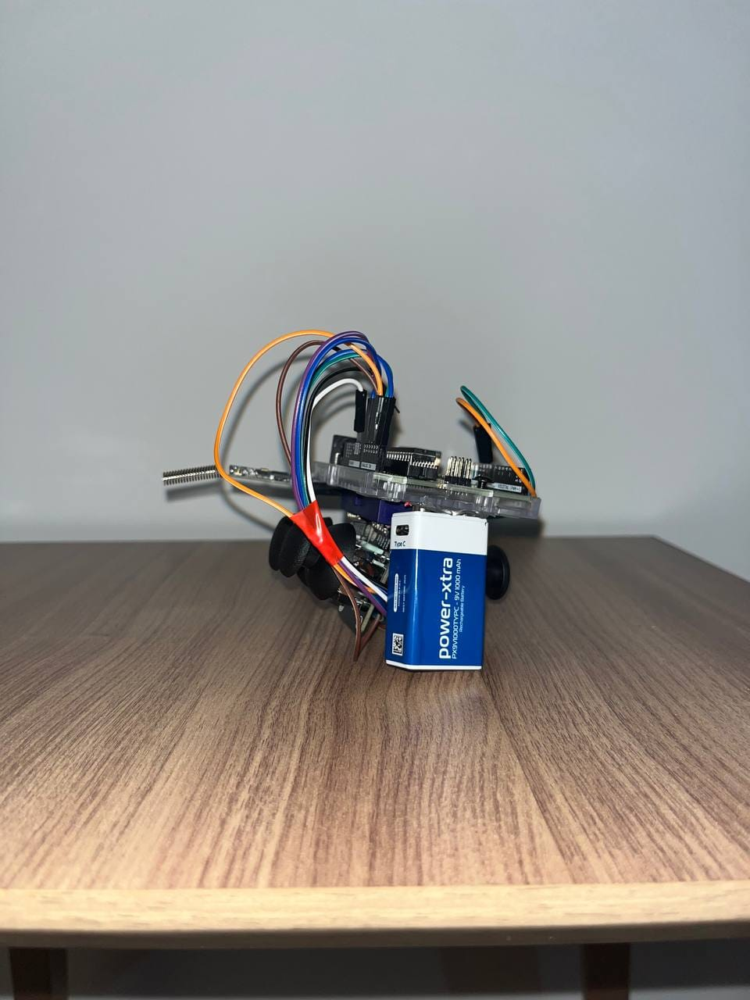 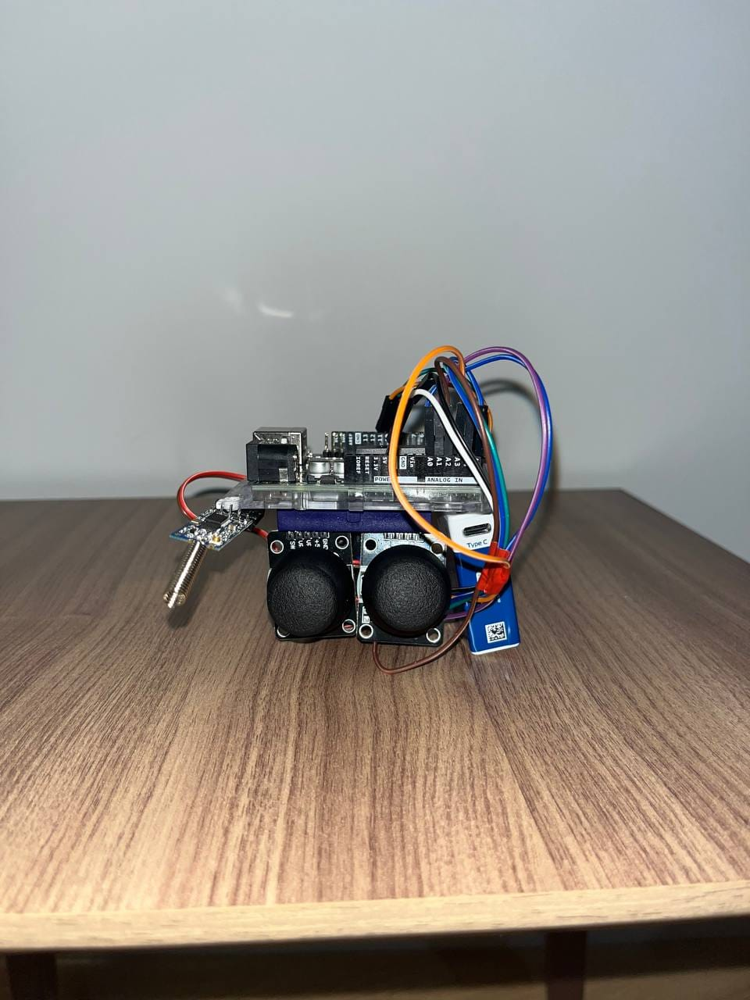 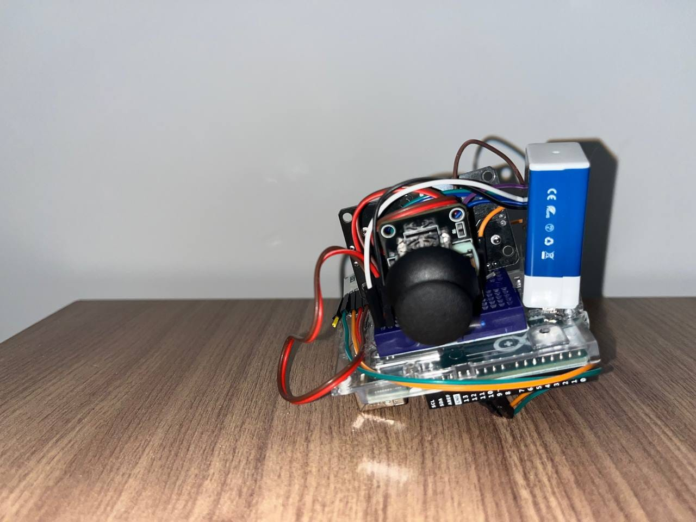
  
---

## Author

* **Nasereldin Osama Mohamed Abduldafi**

*B.Sc. in Mechatronics Engineering, University of the Future (2024)*

*M.Sc. Student in Mechatronic and Cyber-Physical Systems, TH Deggendorf*
